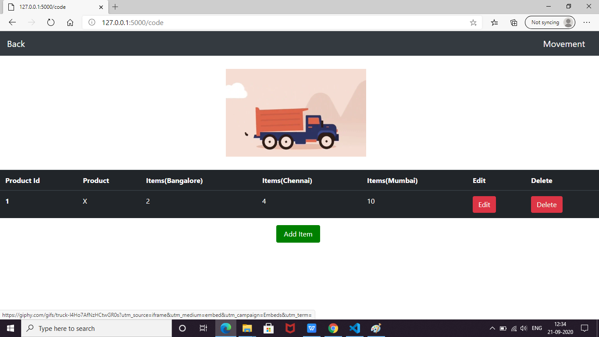
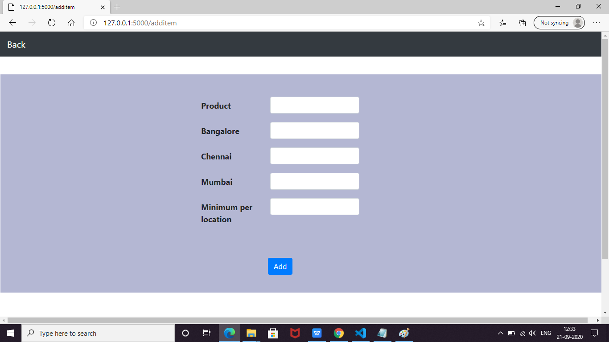
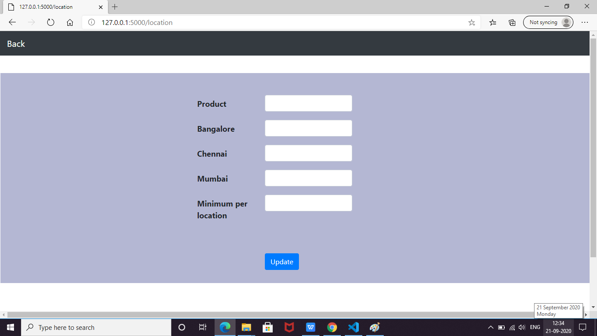
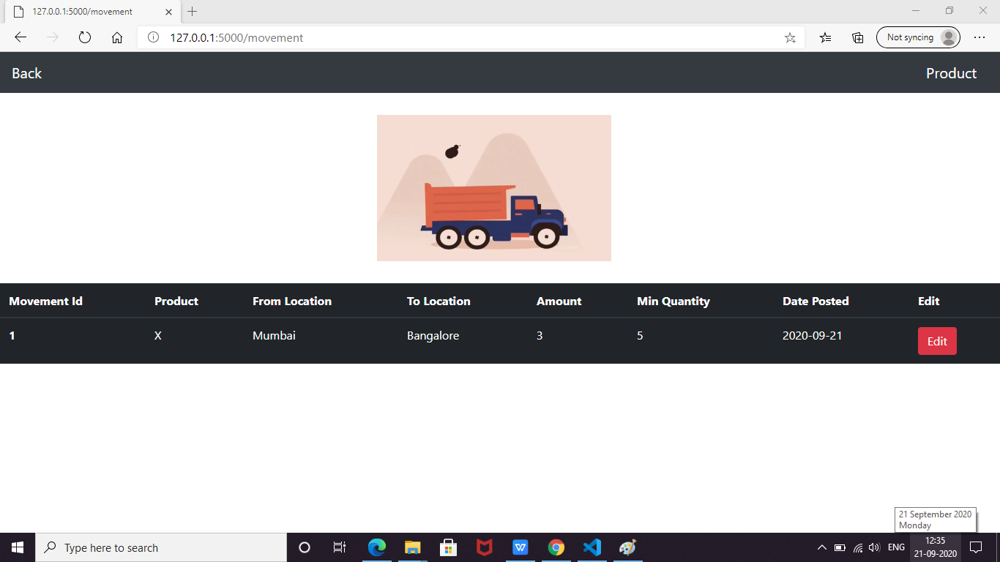

# Inventory-management

This Project is made using Python(Flask),Sqlite(SQLalchemy),HTML and CSS
This is the first page when we click on it, it navigates to the second page.

This page contains our inventory and we can edit, add and delete items from the list

Add

Update

By clicking on the top most right corner of the previous page we can navigate to the movement page where we can track which inventory needs items to be shifted and from where

